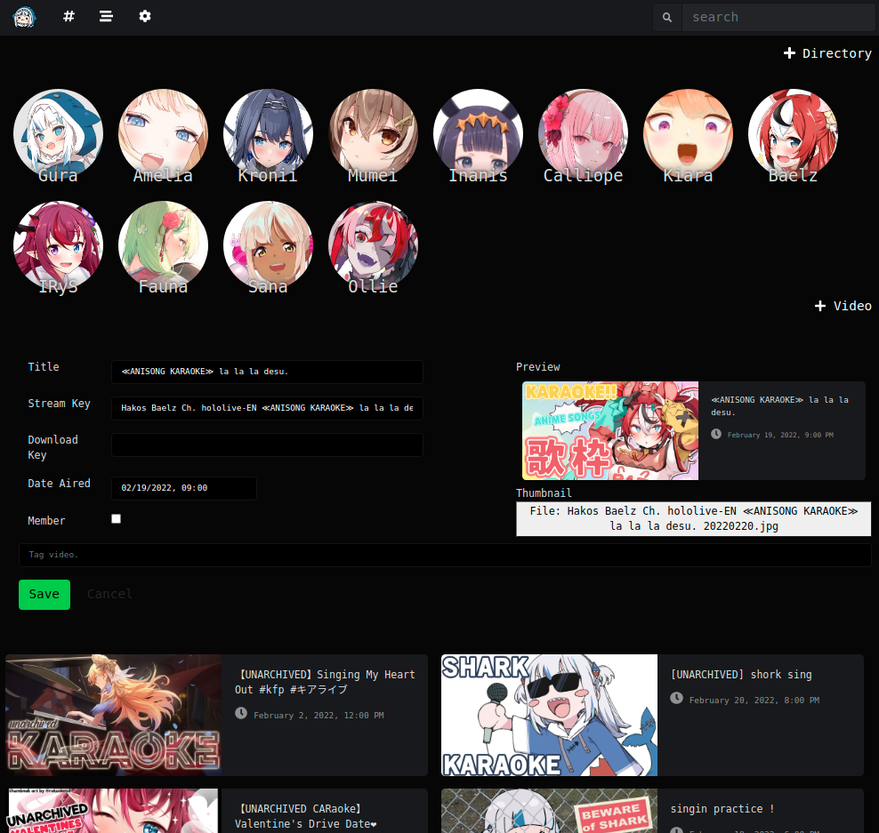

# GOOB / GOOMBA #

Simple-to-use private streaming site, created primarily to host live streams by Hololive members.

<figure>
    
    <figcaption><i>Front page listing Hololive members and recent live streams.</i></figcaption>
</figure>

## Features ##

* Video streaming with Apple HLS.
<figure>
    
    <figcaption><i>Playback of an unarchived karaoke stream.</i></figcaption>
</figure>

* User authentication with Discord OAuth2.
* Link previews with OpenGraph.
<figure>
    
    <figcaption><i>Link preview cards in a Discord message.</i></figcaption>
</figure>

* Directories for organizing and grouping videos.
<figure>
    
    <figcaption><i>All available videos for Gura in her own directory.</i></figcaption>
</figure>

* Admin management panel for adding and editting videos and directories.
<figure>
    
    <figcaption><i>Edit a current listing.</i></figcaption>
</figure>

* Auto-saves user's playback position.

## Upcoming Features ##

* Tagging.
* Direct downloads.

## Infrastructure ##
**Gooba** is built for an AWS stack. The AWS CDK project deploys the front-end and content stack with the following services.

* S3 for hosting site and content.
* CloudFront with Lambda@Edge for distributing site and content.
* Certificate Manager for TLS certs.
* Route 53 for domain name setup.

